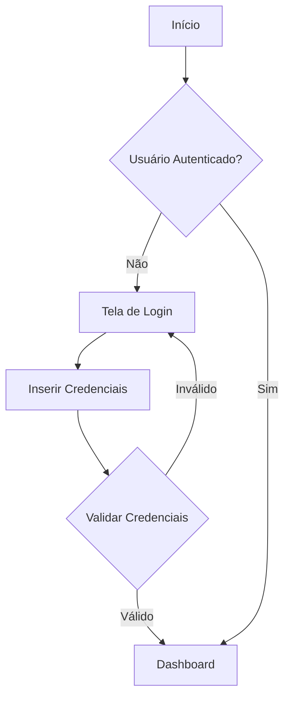
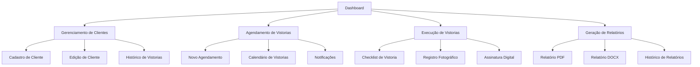

# Sistema de Inspeções

Um sistema web moderno para gerenciamento de inspeções e vistorias técnicas, desenvolvido com React, TypeScript e Vite.

## 🚀 Funcionalidades

- **Autenticação**: Sistema completo de autenticação de usuários
- **Dashboard**: Painel de controle com visão geral das atividades
- **Agenda**: Gerenciamento de agendamentos de vistorias
- **Clientes**: Cadastro e gerenciamento de clientes
- **Vistorias**: Realização e acompanhamento de vistorias técnicas
- **Relatórios**: Geração de relatórios em PDF e DOCX
- **Mapa**: Visualização geográfica das inspeções
- **Configurações**: Personalização do sistema
- **Perfil**: Gerenciamento de informações do usuário

## 📊 Fluxo do Aplicativo

### 1. Autenticação e Acesso



### 2. Fluxo Principal



### 3. Processo de Vistoria

1. **Preparação**

   - Agendamento da vistoria
   - Confirmação com o cliente
   - Designação do vistoriador

2. **Execução**

   - Check-in no local
   - Preenchimento do formulário de vistoria
   - Registro fotográfico
   - Coleta de assinaturas

3. **Finalização**
   - Sincronização dos dados
   - Geração do relatório
   - Envio para aprovação
   - Arquivamento digital

### 4. Integração com Serviços

- **Armazenamento**

  - Supabase para dados estruturados
  - Storage para arquivos e imagens
  - Cache local com IndexedDB

- **Geolocalização**

  - Registro de coordenadas
  - Visualização em mapa
  - Cálculo de rotas

- **Notificações**
  - Lembretes de agendamentos
  - Alertas de prazos
  - Comunicação com clientes

## 🛠️ Tecnologias Utilizadas

- **React 18**: Biblioteca para construção de interfaces
- **TypeScript**: Superset JavaScript com tipagem estática
- **Vite**: Build tool e dev server
- **TailwindCSS**: Framework CSS utilitário
- **React Router**: Roteamento da aplicação
- **Zustand**: Gerenciamento de estado
- **React Hook Form**: Gerenciamento de formulários
- **Framer Motion**: Animações fluidas
- **date-fns**: Manipulação de datas
- **jsPDF & docx**: Geração de documentos
- **IndexedDB (idb)**: Armazenamento local
- **Vitest**: Framework de testes

## 📦 Instalação

```bash
# Clone o repositório
git clone https://github.com/seu-usuario/sistema-de-inspecoes.git

# Entre no diretório
cd sistema-de-inspecoes

# Instale as dependências
npm install

# Inicie o servidor de desenvolvimento
npm run dev
```

## 🔧 Scripts Disponíveis

- `npm run dev`: Inicia o servidor de desenvolvimento
- `npm run build`: Gera a build de produção
- `npm run preview`: Visualiza a build de produção localmente
- `npm run test`: Executa os testes
- `npm run format`: Formata o código com Prettier
- `npm run lint`: Executa o linter (ESLint)
- `npm run type-check`: Verifica tipos TypeScript

## 🏗️ Estrutura do Projeto

```
sistema-de-inspecoes/
├── src/
│   ├── components/     # Componentes reutilizáveis
│   │   ├── auth/      # Componentes de autenticação
│   │   ├── layout/    # Componentes de layout
│   │   └── ui/        # Componentes de interface
│   ├── hooks/         # Hooks customizados
│   ├── lib/          # Utilitários e configurações
│   ├── pages/        # Páginas da aplicação
│   │   ├── agenda/
│   │   ├── auth/
│   │   ├── clientes/
│   │   ├── configuracoes/
│   │   ├── mapa/
│   │   ├── perfil/
│   │   ├── relatorios/
│   │   └── vistorias/
│   └── App.tsx       # Componente principal
├── public/          # Arquivos públicos
└── supabase/        # Configurações do Supabase
```

## 🔒 Boas Práticas

- **Commits Padronizados**: Utilizamos Husky para garantir a qualidade dos commits
- **Formatação Consistente**: Prettier para formatação automática de código
- **Linting Rigoroso**: ESLint configurado com regras estritas
- **Type Safety**: TypeScript com configurações rigorosas
- **Git Hooks**: Lint-staged para verificações antes dos commits

## 🤝 Contribuindo

1. Faça o fork do projeto
2. Crie uma branch para sua feature (`git checkout -b feature/AmazingFeature`)
3. Commit suas mudanças (`git commit -m 'Add some AmazingFeature'`)
4. Push para a branch (`git push origin feature/AmazingFeature`)
5. Abra um Pull Request

## 📝 Licença

Este projeto está sob a licença MIT. Veja o arquivo [LICENSE](LICENSE) para mais detalhes.

## 📫 Contato

Para questões e sugestões, por favor abra uma issue no repositório.

---

Desenvolvido com ❤️ pela equipe do Sistema de Inspeções
